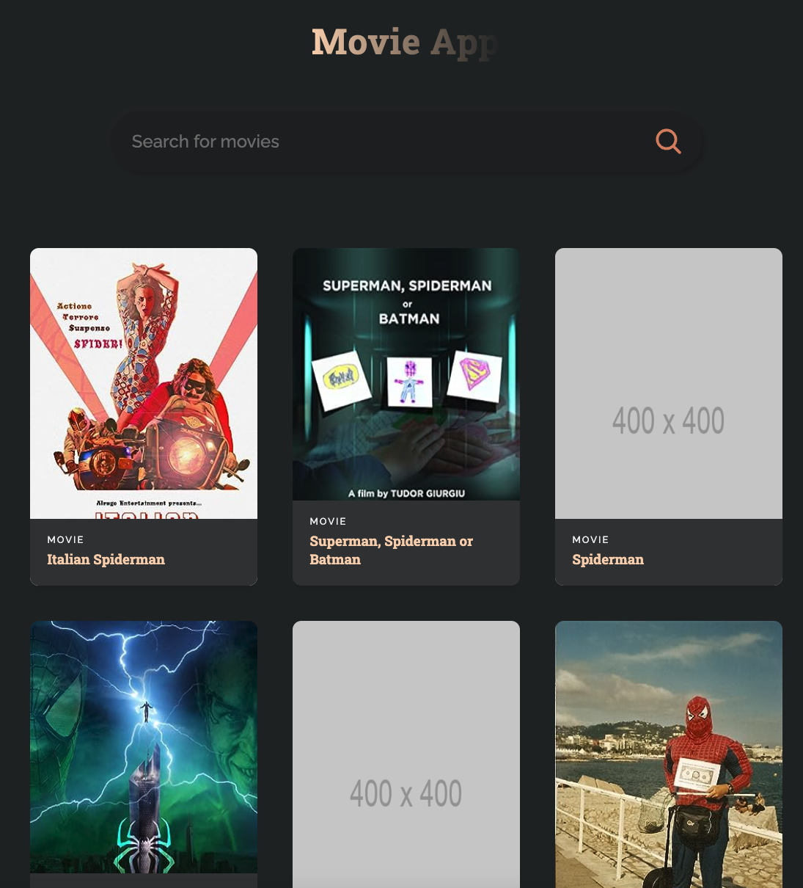

# Movie App



React App to search for movies. Uses [OMDb](https://www.omdbapi.com/) API.

## Clone repository

```shell
git clone https://github.com/samiralibabic/movie-app.git
```

## Setup environment

1. Get your API key from [OMDb API](https://www.omdbapi.com/). 
1. Add `.env` to `.gitignore`
1. Create new `.env` file in project root 
1. Add API key to the `.env` file:

```shell
REACT_APP_API_URL = 'https://www.omdbapi.com?apikey=your_api_key'
```

## Install

```shell
npm install
```

## Run

```shell
npm run start
```
